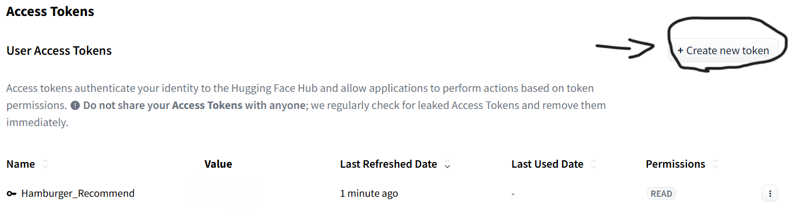
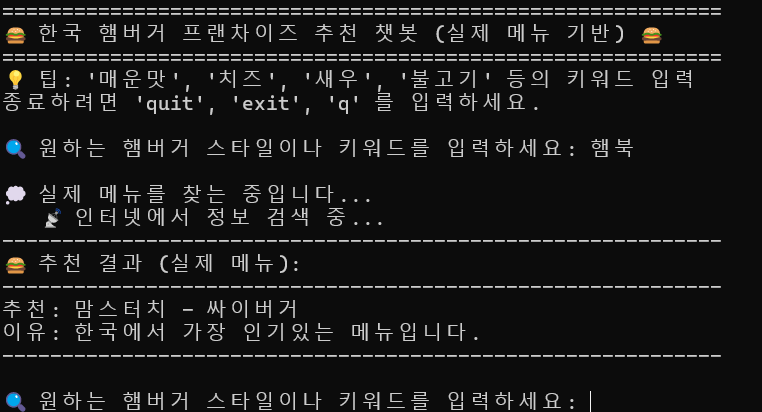

# burger-hamger-hamburger-gerburham

## 필요한 라이브러리 설치 ##

pip install huggingface_hub requests beautifulsoup4

## 토큰 발급 ##

burger_recommend_bot.py의 8번째 줄에 Hugging Face에서 토큰을 발급 받아 값을 집어 넣음
필요시, 89번 줄에 있는 model= 값을 수정하여 원하는 ai모델로 변경가능 
기본 값으로 google/gemma-2-2b-it 모델 사용 중

## 실행 ##

CMD나 Powershell로 burger_recommend_bot.py를 python으로 실행 후, 단순 키워드 입력으로 함부가를 추천 받는다.

## 앞으로 해야할 것 ##

def get_franchise_menus() 으로 메뉴 일일히 입력해둔것 없이 돌리기
추천할 거 없을 때 싸이버거 추천하는 else문 날리기
KFC 클래식징거버거박스 먹기
